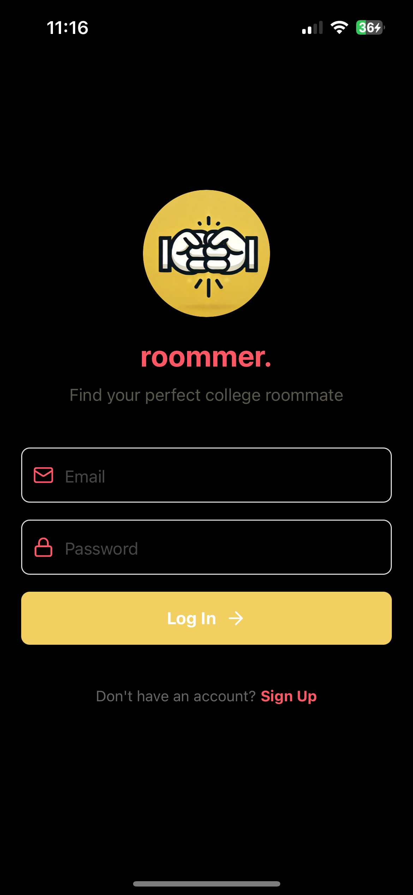
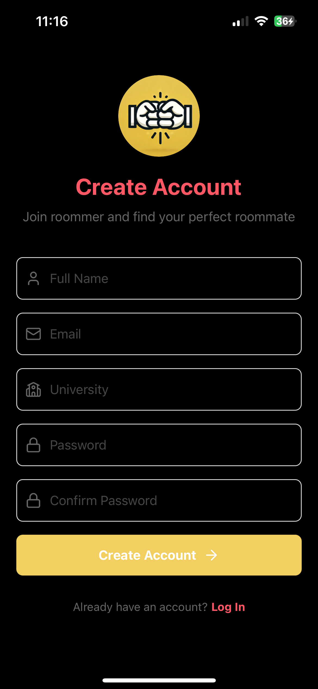
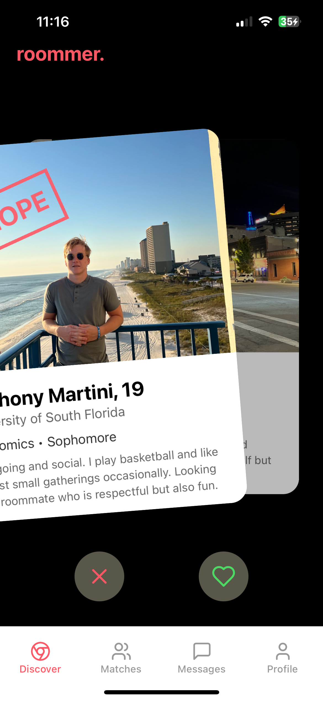
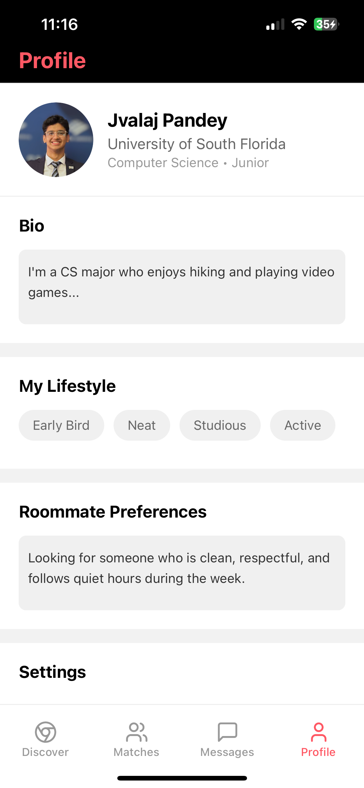
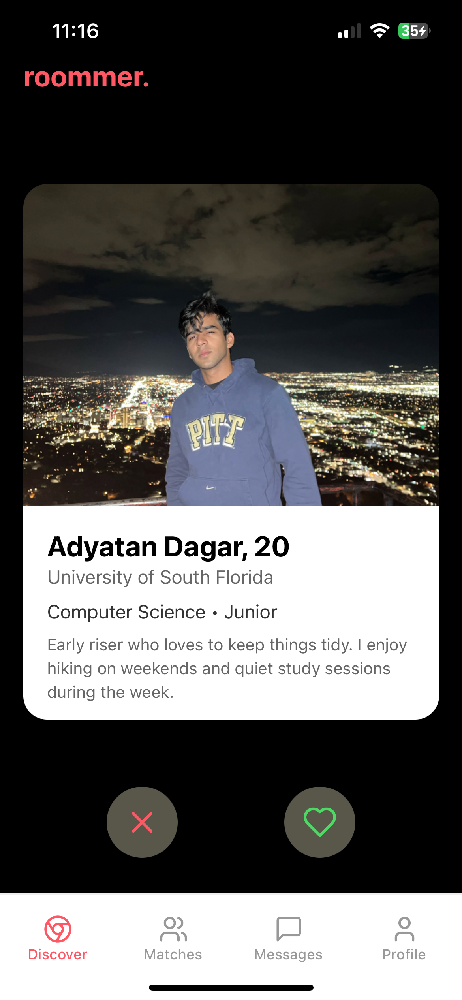

# roommer.

find your perfect college roommate

Roommer is a swipe-based app designed to make finding the perfect college roommate

## features

- Swipe left or right to match with potential roommates.
- Chat directly in the app to break the ice.
- Profiles highlight important stuff: cleanliness level, work-from-home status, pet-friendliness, and more.

---

## technologies Used

- Frontend: React Native (via Expo)
- Backend: Firebase
- Database: Firestore

---

## screenshots

    
    
    
    
    

    
    
    

## installation & Run

git clone https://github.com/yourusername/roommer.git
cd roommer

npm install
npm expo start
npm run build:web

have expo go installed and scan the qr code shown in the terminal

## contact

Made with ❤️ by Jvalaj.  
[LinkedIn](https://www.linkedin.com/in/jvalaj/)
